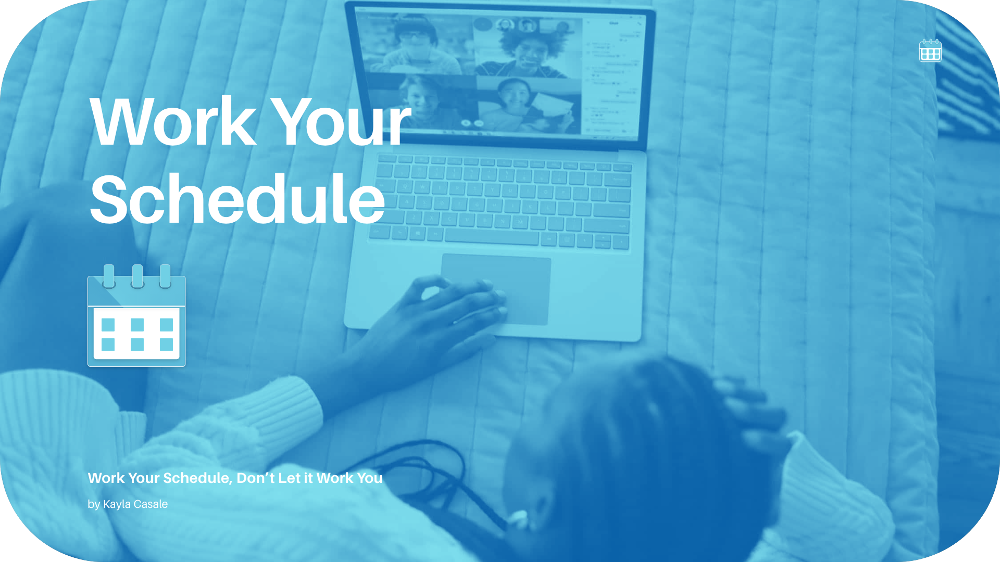
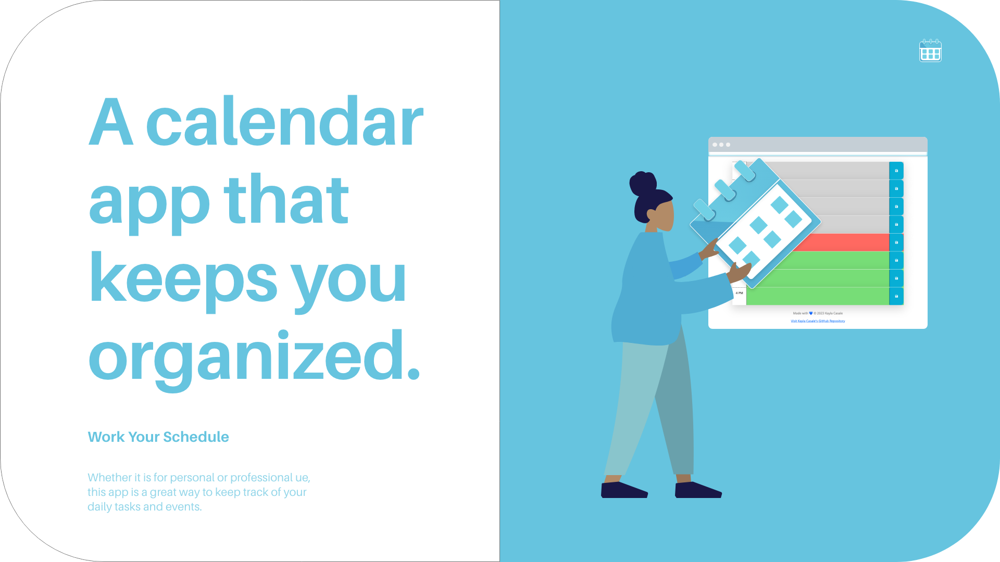
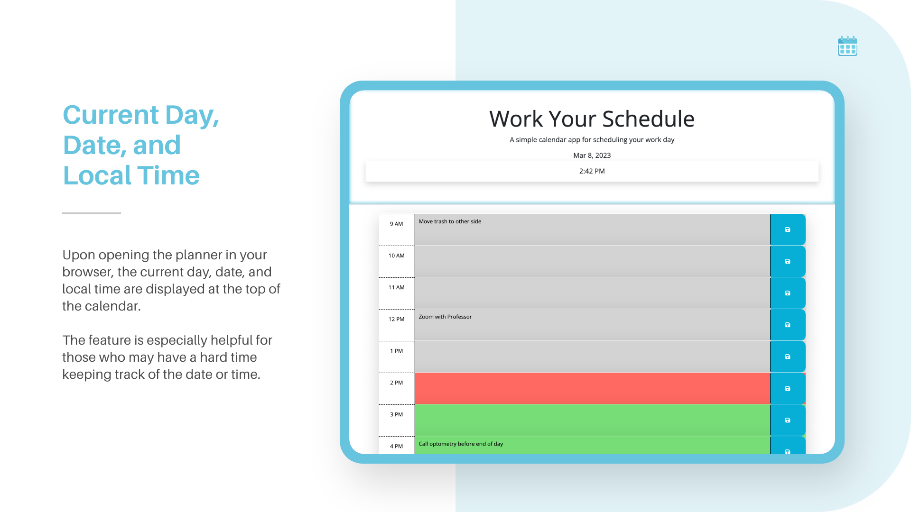
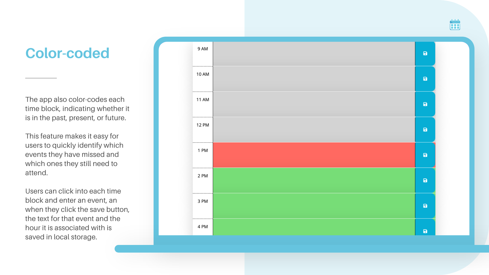
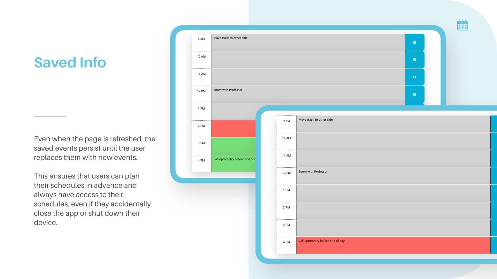

# Workday Scheduler 🗓
### Work your schedule, ~~don't let it work you!~~

## _work-your-schedule_
A simple calendar application that lets any user save events for each hour of the workday in their browser.

## Table of Contents
*[About](#about)
*[Installation](#installation)
*[Deck](#deck)
*[User Story](#user-story)
*[Acceptance Criteria](#acceptance-criteria)
*[Frameworks & Libraries](#frameworks--libraries)
*[Languages](#languages)
*[Mockup](#mockup)
*[Focus Points](#focus-points)

## About
Especially in times of unpredictability and technological growth, keeping track of your schedule is ever more important. Allow this personal, browser-based scheduler to help you think about what you want to achieve in a day, and keep you on track to accomplish these goals. Ensure that you have no unexpected problems and your day runs smoothly.

## Installation
**Link** to ***My Workday Scheduler:*** https://kaylacasale.github.io/work-your-schedule/

**Link** to ***My GitHub repository:*** https://github.com/kaylacasale/work-your-schedule 

## Deck
1. 
2. 
3. 
4. 
5. 
6. 

## User Story
AS an employee with a busy schedule

I WANT to add important event to a daily planner and save them by day

SO THAT I can manage my time effectively

## Acceptance Criteria
GIVEN I am using a daily planner to create and save a daily schedule

WHEN I open the planner in my browser

THEN the current day, date, and local time are displayed at the top of the calendar

WHEN I scroll down

WHEN I view the timeblocks for that day

THEN each timeblock is color coded to indicate whether it is in the past, present, or future

WHEN I click into a timeblock

THEN I can enter an event

WHEN I click the save button for that timeblock

THEN the text for that event and hour it is associated with is saved in local storage
WHEN I refresh the page 

THEN the saved events persist until I replace them with new events

## Frameworks & Libraries
> Bootstrap

> Day.js

> jQuery UI

## Languages 
- HTML

- CSS

- Javascript

## Mockup
This mockup displays the appearance and functionality of the deployed web application.

<!-- https://user-images.githubusercontent.com/115776118/208210604-75c40196-1b42-45dd-8681-41c19837e737.mov -->

### Focus Points
Web APIs | Data-Attributes | Local Storage (arrays, objects, array of objects) | Algorithms (for loops to create dynamic elements and store data) | jQuery Elements | Click Events | Form Elements | DOM Traversal | Event Delegation | Bootstrap Components | Bootstrap Layout | Bootstrap Utilities | DayJS Format 
